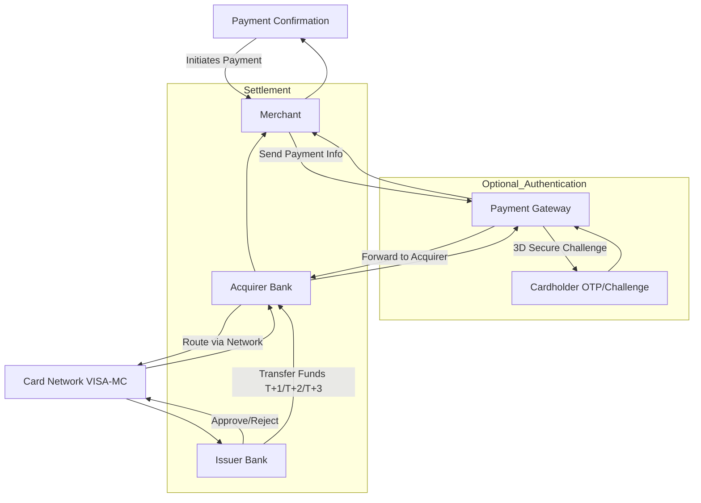

<h1 align="center">💳 VISA & Mastercard Transaction 101.1</h1>

  
  
  
  
  
  
  
  

---

  

---

<h2 align="center">📖 Deskripsi</h2>

Topik ini membahas <b>VISA & Mastercard Transaction</b> secara dasar dan teknis. 
Tujuan: memahami alur transaksi elektronik, peran bank dan jaringan kartu, jenis transaksi, dan keamanan kartu. 
Berguna untuk edukasi Cyber Security, FinTech, dan blockchain payment insight.

---

<h2 align="center"> 📈 Alur Transaksi Kartu Kredit</h2>

<h3 align="center"> Diagram di bawah ini menggambarkan alur transaksi kartu kredit secara sederhana.</h3>h

  

<h2 align="center">⚡ Struktur Dasar Kartu</h2>

<table border="1" cellpadding="10" cellspacing="0" style="border-collapse: collapse;">
  <thead>
    <tr>
      <th>Elemen</th>
      <th>Keterangan</th>
    </tr>
  </thead>
  <tbody>
    <tr>
      <td>Card Number (PAN)</td>
      <td>16 digit unik kartu</td>
    </tr>
    <tr>
      <td>Cardholder Name</td>
      <td>Nama pemilik kartu</td>
    </tr>
    <tr>
      <td>Expiry Date</td>
      <td>Bulan/Tahun kadaluarsa</td>
    </tr>
    <tr>
      <td>CVV/CVC</td>
      <td>3 digit keamanan di belakang kartu</td>
    </tr>
    <tr>
      <td>Issuer Bank</td>
      <td>Bank penerbit kartu</td>
    </tr>
    <tr>
      <td>Network</td>
      <td>VISA / Mastercard</td>
    </tr>
  </tbody>
</table>

---

<h2 align="center">🚀 Alur Transaksi (Basic Flow)</h2>

1. <b>Authorization</b> → Pemegang kartu → Merchant → Payment Gateway → Acquirer Bank → Card Network → Issuer Bank → Approve/Reject 
2. <b>Authentication (Opsional)</b> → 3D Secure (Verified by Visa / Mastercard SecureCode) → OTP atau challenge 
3. <b>Clearing</b> → Transaksi disetujui → dikumpulkan dalam batch untuk diproses 
4. <b>Settlement</b> → Uang dikirim dari Issuer Bank → Acquirer Bank → Merchant (T+1 sampai T+3 hari kerja)

---

<h2 align="center">🏦 Peran dalam Network</h2>

<table border="1" cellpadding="10" cellspacing="0" style="border-collapse: collapse;">
  <thead>
    <tr>
      <th>Role</th>
      <th>Fungsi</th>
    </tr>
  </thead>
  <tbody>
    <tr>
      <td>Cardholder</td>
      <td>Pemilik kartu</td>
    </tr>
    <tr>
      <td>Merchant</td>
      <td>Penjual / penyedia jasa</td>
    </tr>
    <tr>
      <td>Acquirer Bank</td>
      <td>Bank merchant, menerima transaksi</td>
    </tr>
    <tr>
      <td>Issuer Bank</td>
      <td>Bank pemegang kartu</td>
    </tr>
    <tr>
      <td>Card Network</td>
      <td>VISA / Mastercard, routing & settlement</td>
    </tr>
  </tbody>
</table>

---

<h2 align="center">🔹 Jenis Transaksi</h2>

- Purchase Transaction: Pembelian barang/jasa 
- Cash Advance: Penarikan tunai di ATM 
- Refund: Pengembalian dana 
- Reversal: Pembatalan transaksi yang salah

---

<h2 align="center">🔒 Security & Verification</h2>

- CVV/CVC: Verifikasi kartu valid 
- 3D Secure: Lapisan tambahan untuk transaksi online 
- Tokenization: Ganti PAN dengan token 
- Encryption: Semua data kartu dienkripsi saat dikirim

---

<h2 align="center">💡 Contoh Sederhana</h2>

1. Pembelian $100 di toko online 
2. Merchant → Payment Gateway → Acquirer → VISA Network → Issuer 
3. Issuer cek saldo → Approve $100 
4. Gateway memberi respon ke merchant → konfirmasi ke customer 
5. Settlement → uang sampai ke merchant T+1/2/3

---

<h2 align="center">🛠️ Pengembangan</h2>

<pre>
git clone https://github.com/kongali1720/visa-mc-transaction.git
cd visa-mc-transaction
# Bisa tambahkan simulasi Authorization, 3D Secure, dan Settlement
</pre>

---

<h2 align="center">📜 License</h2>

This project is licensed under the <a href="LICENSE">MIT License</a>. 
You are free to use, modify, and distribute this project under the terms of MIT.

---

<h3 align="center" style="color:#39ff14; font-size:1.5rem;">
💡 ☕ Traktir Kopi & Nasi Padang / Nasi Gorengnya ya cuy! 😄
</h3>

Dukung terus biar semangat bikin karya edukatif lainnya...  
Keep supporting so I stay motivated to create more educational works!

Support with ☕ so I can buy 🍜 and keep being 🧠!

---

<h2 align="center" style="color:#39ff14;">📫 Let’s Connect Like Hackers</h2>

<table style="margin: 0 auto; border-collapse: collapse;">
  <thead>
    <tr>
      <th style="padding: 12px 25px; font-size: 18px; color:#ffffff;">Platform</th>
      <th style="padding: 12px 25px; font-size: 18px; color:#ffffff;">Detail</th>
    </tr>
  </thead>
  <tbody>
    <tr>
      <td style="padding: 12px 25px; color:#39ff14;">GitHub</td>
      <td style="padding: 12px 25px;"><a href="https://github.com/kongali1720" target="_blank">kongali1720</a></td>
    </tr>
    <tr>
      <td style="padding: 12px 25px; color:#39ff14;">Email</td>
      <td style="padding: 12px 25px;"><a href="mailto:kongali1720@gmail.com">kongali1720@gmail.com</a></td>
    </tr>
    <tr>
      <td style="padding: 12px 25px; color:#39ff14;">Site</td>
      <td style="padding: 12px 25px;"><a href="https://younext.cloud" target="_blank">Coming soon — stay curious...</a></td>
    </tr>
  </tbody>
</table>

---

<h3 align="center" style="color:#ff69b4;">❤️ 💻 INITIATING HUMANITY MODE... for Down Syndrome ❤️</h3>

<table style="margin: 0 auto; border-collapse: collapse; box-shadow: 0 4px 10px rgba(0,0,0,0.2); border-radius: 8px; overflow: hidden;">
  <thead style="background-color:#ff69b4; color:white;">
    <tr>
      <th style="padding: 12px 25px; font-size: 18px;">Item</th>
      <th style="padding: 12px 25px; font-size: 18px;">Keterangan / Description</th>
    </tr>
  </thead>
  <tbody style="background-color:#1a1a1a; color:#39ff14;">
    <tr>
      <td style="padding: 12px 25px;">🎯 Target</td>
      <td style="padding: 12px 25px;">Anak-anak Pejuang Down Syndrome / Kids with Down Syndrome</td>
    </tr>
    <tr>
      <td style="padding: 12px 25px;">📡 Status</td>
      <td style="padding: 12px 25px;">Butuh Dukungan / Needs Support</td>
    </tr>
    <tr>
      <td style="padding: 12px 25px;">🧠 Response</td>
      <td style="padding: 12px 25px;">Buka Hati + Klik Link = Satu Senyum Baru / Open Heart + Click Link = One New Smile</td>
    </tr>
  </tbody>
</table>

Mereka bukan berbeda — mereka dilahirkan untuk mengajarkan dunia tentang cinta yang murni dan kesabaran yang luar biasa. 
They are not different — they were born to teach the world pure love and extraordinary patience.

  

---

<section align="center" style="font-family: Arial, sans-serif;">

<h2 style="margin-bottom: 15px; color: #0070f3;">💳 Dukungan Pembayaran</h2>

<table align="center" style="margin: 0 auto; border-collapse: collapse; border-radius: 8px; overflow: hidden;">
  <thead style="background-color: #0070f3; color: white;">
    <tr>
      <th style="padding: 10px 20px; font-size: 16px;">Visa</th>
      <th style="padding: 10px 20px; font-size: 16px;">Mastercard</th>
      <th style="padding: 10px 20px; font-size: 16px;">PayPal</th>
    </tr>
  </thead>
  <tbody style="background-color: #f9f9f9;">
    <tr>
      <td style="padding: 10px;">
        
      </td>
      <td style="padding: 10px;">
        
      </td>
      <td style="padding: 10px;">
        
      </td>
    </tr>
  </tbody>
</table>

</section>

---

  Kalau project ini bantu kamu, jangan lupa kasih bintang ⭐ dan share ke teman-teman! 
  Follow <a href="https://twitter.com/kongali1720" target="_blank">@kongali1720</a> untuk diskusi & update seru 🔥

  

